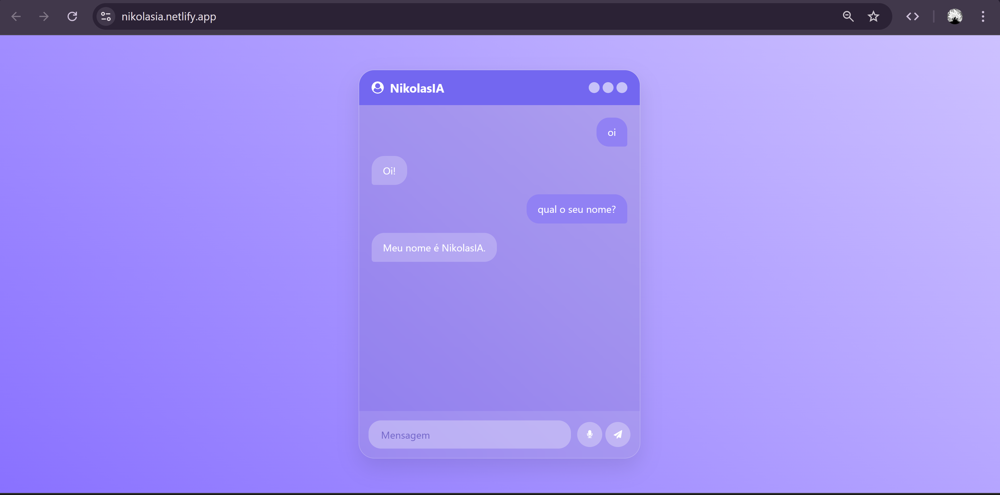

# 🤖 NikolasIA

  

A interface oficial da **NikolasIA**, uma aplicação de chat inteligente com design *Glassmorphism*. O projeto utiliza modelos de linguagem de última geração para oferecer respostas rápidas e precisas em uma interface elegante.

🌐 **Acesse o projeto:** [nikolasia.netlify.app](https://nikolasia.netlify.app)

---

## ✨ Funcionalidades

* **🧠 Inteligência Artificial:** Integração via API com o modelo `llama-3.3-70b` (Groq/OpenAI compatible).
* **💬 Histórico Persistente:** As conversas são salvas automaticamente no `localStorage` do navegador.
* **🎙️ Comando de Voz:** Reconhecimento de fala integrado (Web Speech API) para enviar mensagens.
* **🎨 Design Glassmorphism:** Interface moderna com efeitos de transparência e desfoque.
* **🌓 Modo Escuro:** Suporte a temas com persistência de preferência do usuário.
* **🧹 Gestão de Cache:** Opção para limpar o histórico de mensagens localmente.

---

## 🛠 Tecnologias e APIs

* **Llama 3.3 (via Groq Cloud):** Processamento de linguagem natural de alta performance.
* **JavaScript (ES6+):** Lógica assíncrona (`async/await`) para chamadas de API.
* **Web Speech API:** Utilizada para a funcionalidade de transcrição de voz.
* **HTML5/CSS3:** Estrutura e estilização avançada (Flexbox e variáveis CSS).
* **Font Awesome:** Ícones interativos.

---

## ⚙️ Detalhes Técnicos

A NikolasIA foi configurada com uma camada de personalização no prompt para manter sua identidade:
- **Identidade:** Responde como NikolasIA.
- **Criador:** Desenvolvida por **nikolasdev**.
- **Contexto:** Possui conhecimento sobre seu criador (Nikolas).

---

## 🚀 Como executar o projeto

1. Clone o repositório.
2. Certifique-se de configurar sua chave de API no arquivo `scripts.js`.
3. Abra o `index.html` e comece a conversar!

---

## 👤 Autor

Projeto idealizado e desenvolvido por **Nikolas Dev**.

> **Nota:** Nikolas é um entusiasta de tecnologia e inteligência artificial.

---
🚀 *Desenvolvido com foco em inovação por Nikolas Dev.*